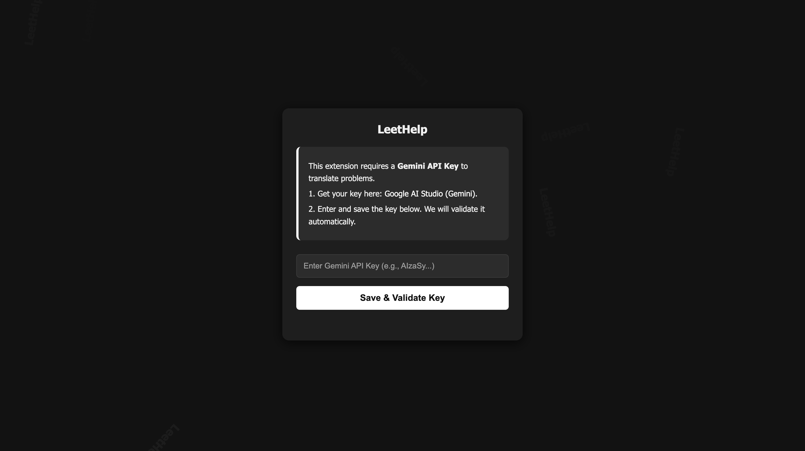
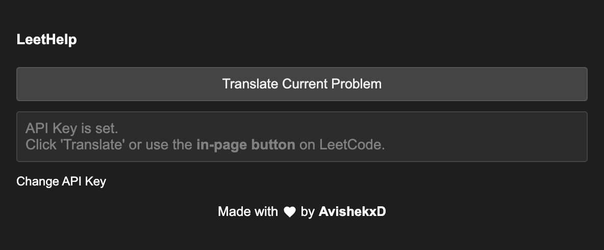
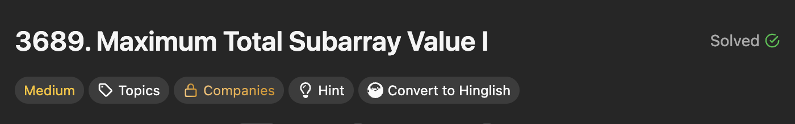

# LeetHelp 🔥  
_LeetHelp is a lightweight Chrome extension built to help students and developers understand LeetCode problems more easily. With just one click, you can translate any problem statement from English into Hinglish (a mix of Hindi + English) - making concepts clearer and easier to grasp._

---

## 📸 Screenshots





---

## 📌 Features
- 📝 **One-click Hinglish(Selected Language) translation** of LeetCode problem statements.  
- 🔄 **Toggle button beside the "Hint" button** → switch between English and Hinglish - (Selected language).  
- 📖 **Inline translation display** → Hinglish - (Selected language) text appears right below the original problem statement.  
- 💾 **Caching support** → no duplicate API calls for the same problem.  
- ⚡ **Non-intrusive UI** → follows LeetCode’s styling to feel native.  

---

## 🛠 Tech Stack
- JavaScript (content scripts + DOM manipulation)
- Chrome Extensions API
- Gemini-Api 2.5 flash

---

## 📁 Folder Structure
```bash
LeetHelp/
├── icons/
│   ├── favicon.ico
│   ├── icon16.png
│   ├── icon48.png
│   ├── icon128.png
│   ├── image.png
│   ├── image-1.png
│   └── image-2.png
│
├── .gitignore
├── background.js          # Handles background logic and translation API requests
├── content.js             # Injected into LeetCode pages to manipulate DOM and render translations
├── manifest.json          # Chrome extension manifest configuration (v3)
├── options.html           # Settings UI (API key + language selection)
├── options.js             # Logic for saving and managing user settings
├── popup.html             # Popup UI displayed on extension icon click
├── popup.js               # Popup logic (trigger translation, display output)
├── README.md              # Project documentation
├── styles.css             # Global styles (for translation UI, popup, and options page)
```
---

## ✨ Future Ideas
- 📌 Images, Code, Inputs of examples in our mode. (Done ✅)
- 🌙 Dark mode optimized UI. (Partially Done ...)
- 📚 Multi-Language Support(for example - Runglish (Russian + English), Portuñol / Portenglish (Portuguese + English), Konglish (Korean + English)). (Done ✅)

---

## 🚀 Installation (Developer Mode)
1. Clone this repository:
   ```bash
    git clone https://github.com/avishekxd/LeetHelp.git
    cd LeetHelp
    Open Chrome → chrome://extensions/.

    Enable Developer Mode (top right).

    Click Load unpacked and select the LeetHelp folder.

    Open LeetCode
    and you’ll see the "Convert to Hinglish" button appear. click on it and setup your gemini api key and 
    you know what thats all, enjoy :D.

---

Made with ❤️ by [AvishekxD](https://github.com/AvishekxD)